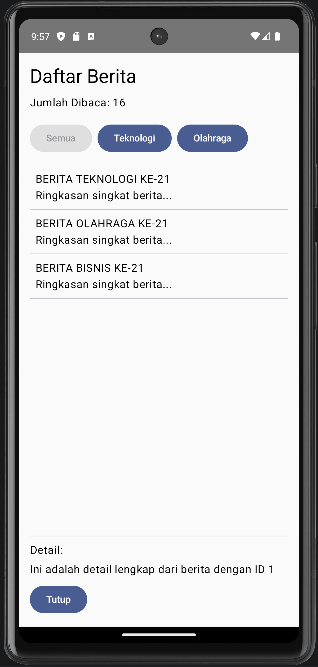

## Tampilan Aplikasi

## Deskripsi
Aplikasi ini dibuat untuk mengimplementasikan
Kotlin Flow, StateFlow, dan Coroutines.

## Fitur
- Update otomatis setiap 2 detik
- Filter kategori
- Counter berita dibaca
- Detail berita async

## Cara Menjalankan
1. Buka project di android studio
2. Pastikan device / emulator aktif
3. Klik Run
4. Aplikasi akan menampilkan daftar berita yang terus update
